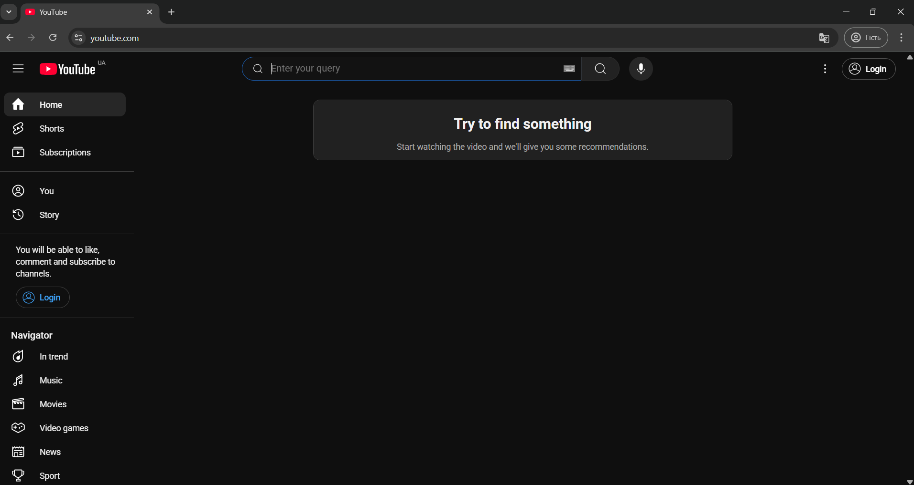

<html lang="en">
<head>
  <meta charset="UTF-8">
  <title>How to Embed a YouTube Video</title>
  <link rel="stylesheet" href="look.css">
</head>
<body>
  <h1>How to Embed a YouTube Video</h1>

  <section>
    <h2>Step 1: Go to the YouTube</h2>
    
Find the YouTube in your browser. <a href="https://www.youtube.com">YouTube</a>

    
	
  </section>

  <section>
    <h2>Step 2: Go to the YouTube page and find the video you need.</h2>
    
Open the YouTube in your browser.

    
	 
  </section>

  <section>
    <h2>Step 3: Choose video</h2>
    
Choose the <strong>suitable</strong> video.

    
  </section>

  <section>
    <h2>Step 4: Copy the URL of video</h2>
    
Click "Copy" to copy URL.

    
  </section>

  <section>
    <h2>Step 5: Paste the URL code into your HTML</h2>
    
Open your HTML file in a code editor and paste the iframe code where you want the video to appear.

    
  </section>

  <section>
    <h2>Example Embedded Video</h2>
    
Here is the embedded video used in this tutorial:

    

      <iframe width="560" height="315" src="https://www.youtube.com/embed/8dRnTwuFYS4" 
              title="YouTube video player" frameborder="0" allowfullscreen></iframe>
    

  </section>
</body>
</html>

